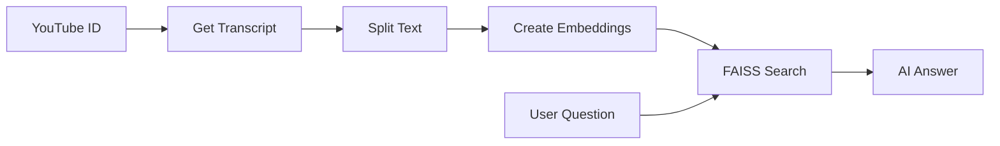

# 🎥 YouTube RAG Chatbot

> **Ask questions about any YouTube video and get AI-powered answers from its transcript**

[](https://streamlit.io/)
[](https://www.python.org/downloads/)

## 🚀 Features

- **Smart Transcript Analysis**: Automatically fetches and processes YouTube video transcripts
- **AI-Powered Q&A**: Uses Google Gemini for contextually accurate answers
- **Vector Search**: FAISS-powered semantic search for relevant content retrieval
- **Clean Interface**: Simple, responsive Streamlit web application
- **Error Handling**: Gracefully manages videos without transcripts

---

## 📦 Quick Start

### Installation

```bash
# Clone and navigate
git clone https://github.com/yourusername/youtube-rag-chatbot.git
cd youtube-rag-chatbot

# Create virtual environment
python -m venv venv
source venv/bin/activate  # Linux/Mac
# venv\Scripts\activate   # Windows

# Install dependencies
pip install -r requirements.txt

# Set up API key
echo "GOOGLE_API_KEY=your_google_api_key_here" > .env

# Run the app
streamlit run ytchat.py
```

### Usage

1. **Enter YouTube Video ID** (e.g., `dQw4w9WgXcQ` from the URL)
2. **Ask your question** about the video content
3. **Get AI-generated answers** based on the transcript

---

## 🔧 How It Works



1. **Transcript Extraction**: Fetches video transcript using `youtube-transcript-api`
2. **Text Processing**: Splits content into chunks with `LangChain`
3. **Vector Storage**: Creates embeddings and stores in `FAISS` for fast retrieval
4. **AI Generation**: Uses `Google Gemini` to generate contextual answers

---

## 📁 Project Structure

```
youtube-rag-chatbot/
├── 📄 ytchat.py            # Main Streamlit application
├── 📄 requirements.txt     # Python dependencies  
├── 📄 README.md            # Documentation
└── 📄 .gitignore           # Git ignore patterns
```

---

## 🚀 Deployment

### Streamlit Cloud

1. Push code to GitHub repository
2. Connect to [Streamlit Cloud](https://streamlit.io/cloud)  
3. Add API key in secrets:
   ```toml
   GOOGLE_API_KEY = "your_api_key_here"
   ```
4. Deploy automatically

### Docker

```dockerfile
FROM python:3.11-slim
WORKDIR /app
COPY requirements.txt .
RUN pip install -r requirements.txt
COPY . .
EXPOSE 8501
CMD ["streamlit", "run", "ytchat.py", "--server.port=8501", "--server.address=0.0.0.0"]
```

---

## 🛠️ Tech Stack

| Component | Technology |
|-----------|------------|
| **Frontend** | Streamlit |
| **LLM** | Google Gemini |
| **Embeddings** | HuggingFace |
| **Vector Store** | FAISS |
| **Framework** | LangChain |

---

## 🤝 Contributing

1. Fork the repository
2. Create feature branch: `git checkout -b feature-name`
3. Commit changes: `git commit -m "Add feature"`
4. Push and open Pull Request

---

## 👨‍💻 Author

**Rohith Gowda K**
- GitHub: [@RohithGowdaK](https://github.com/RohithGowdaK)
- Email: rohithgowdak18@gmail.com

---

<div align="center">

**⭐ Star this repo if it helped you! ⭐**

</div>
